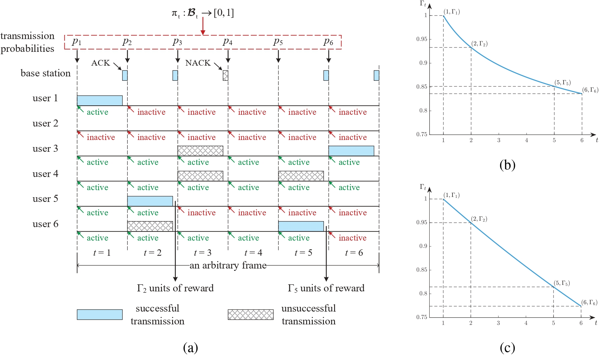

# Achieving Maximum Urgency-Dependent Throughput in Random Access

Yijin Zhang, [Aoyu Gong](https://aygong.com/), Lei Deng, [Yuan-Hsun Lo](https://sites.google.com/view/yuanhsunlo/home), Yan Lin, [Jun Li](http://www.deepiiotlab.com/)

`IEEE` | `Technical Report` | `BibTeX`

<div align="center">
<p>

</p>
</div>
<table>
      <tr><td><em>Figure: An example of the working procedure of the proposed protocol for N = 6 and D = 6.</em></td></tr>
</table>

Designing efficient random access is a vital problem for urgency-constrained packet delivery in uplink Internet of Things (IoT), which has not been investigated in depth so far. In this paper, we focus on unpredictable frame-synchronized traffic, which captures a number of scenarios in IoT communications, and generalize prior studies on this issue by considering a general ALOHA-like protocol, a general single-packet reception (SPR) channel, urgency-dependent throughput (UDT) based on a general urgency function, and the dynamic programming optimality. With a complete knowledge of the number of active users, we use the theory of Markov Decision Process (MDP) to explicitly obtain optimal policies for maximizing the UDT, and prove that a myopic policy is in general optimal. With an incomplete knowledge of the number of active users, we use the theory of Partially Observable MDP (POMDP) to seek optimal policies, and show that a myopic policy is in general not optimal by presenting a counterexample. Because of the prohibitive complexity to obtain optimal or near-optimal policies for this case, we propose two practical policies that utilize the inherent property of our MDP framework and channel model. Simulation results show that both outperform other alternatives. The robustness under relaxed system settings is also examined.


## Configuration

You can reproduce our experiments using **MATLAB R2021a**.

- Clone the repository: `git clone https://github.com/aygong/udt-random-access.git`

- Run the script: `main.m`

> The code may be compatible with the previous versions of MATLAB.


## Quick Start

1. Set the type of the system assumptions.

   - Run experiments under the basic system assumption.
     - Set `system_assumption = 'basic-configuration'`.

   - Run experiments under the relaxed system assumptions.
     - Set `system_assumption = 'unknown-lambda' `  for unknown $\lambda$.
     - Set `system_assumption = 'heterogeneous-lambdas' ` for heterogeneous $\lambda_1, \lambda_2, \cdots, \lambda_N$.
     - Set `system_assumption = 'unsynchronized-traffic' ` for unsynchronized periodic traffic.
     - Set `system_assumption = 'dynamic-number'`  for varied $N$.
2. Set the types of the metric, the channel model, and the urgency function.
   - Change `metric_type`, `channel_type`, and `urgency_type` in `main.m`.
3. Set the simulation parameters.
   - Change `simu_switch`, `simu_indept`, and `simu_frames` in the separate `run` scripts.


## Folder Structure

```bash
./udt-random-access/
├── README.md
|
├── basic-configuration/
|   ├── run_basic_config.m       # Run experiments under the basic system assumption
|   ├── basic_opt_ana.m          # Analyze the optimal policy (idealized)
|   ├── basic_opt_sim.m          # Simulate the optimal policy (idealized)
|   ├── basic_simQ_sim.m         # Simulate the simplified QMDP-based policy (realistic)  
|   ├── basic_furQ_sim.m         # Simulate the further simplified QMDP-based policy (realistic)
|   ├── basic_myo_sim.m          # Simulate the myopic policy (realistic)
|   ├── basic_sta_ana.m          # Analyze the optimal static scheme (realistic)
|   ├── basic_sta_sim.m          # Simulate the optimal static scheme (realistic)
|   ├── basic_DaH_ana.m          # Analyze the D&H scheme (realistic)
|   └── basic_DaH_sim.m          # Simulate the D&H scheme (realistic)
|
├── unknown-lambda/
|   ├── run_unknown_lambda.m     # Run experiments under unknown lambda
|   ├── unknown_simQ_sim.m
|   ├── unknown_furQ_sim.m
|   └── unknown_myo_sim.m
|
├── heterogeneous-lambdas/
|   ├── run_heter_lambdas.m      # Run experiments under heterogeneous lambdas
|   ├── asymmetric_binomial.m    # Compute the joint distribution of Bernoulli random variables
|   ├── heter_simQ_sim.m
|   ├── heter_furQ_sim.m
|   ├── heter_myo_sim.m
|   └── heter_sta_sim.m
|
├── unsynchronized-traffic/
|   ├── run_unsync_traffic.m     # Run experiments under unsynchronized periodic traffic
|   ├── unsync_simQ_sim.m
|   ├── unsync_furQ_sim.m
|   └── unsync_sta_sim.m
|
├── dynamic-number/
|   ├── run_dynamic_number.m     # Run experiments under the varied number of users
|   └── dynamic_sta_sim.m
|
├── main.m                       # Compare the UDT/PLR performance
├── function_computing.m         # Compute the MDP and POMDP functions
├── QF_computing.m               # Compute the Q-functions
└── metric_computing.m           # Compute the metric
```


## Citation

If you find the code helpful, please consider citing our paper:

```
TBA
```
